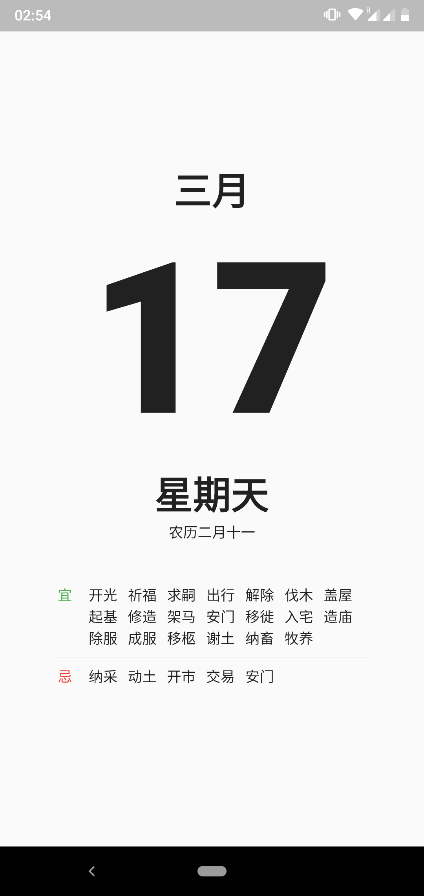

## Intro

I'm trying to master the Google's [Flutter](https://flutter.dev/) Framework, and this is my playground project.

The whole project is built on Flutter. The production channel is on Android only right now. Here is the [Google Play page](https://play.google.com/store/apps/details?id=com.b4whitby.onecalender). You are welcomed to download and test it out.

Any feedback, please send to me by [this form](https://forms.gle/P7eKpwr6eWYJ8RC59). Thank you for your interests!

## Feature

- View the current date
- View lunar calendar information of the day
- get a rough explaination on the lunar calender and Fengshui terms.
- Night mode with a dark theme.

## Privacy Policy

This app (version 1.0) will not read any personal information from the user.
